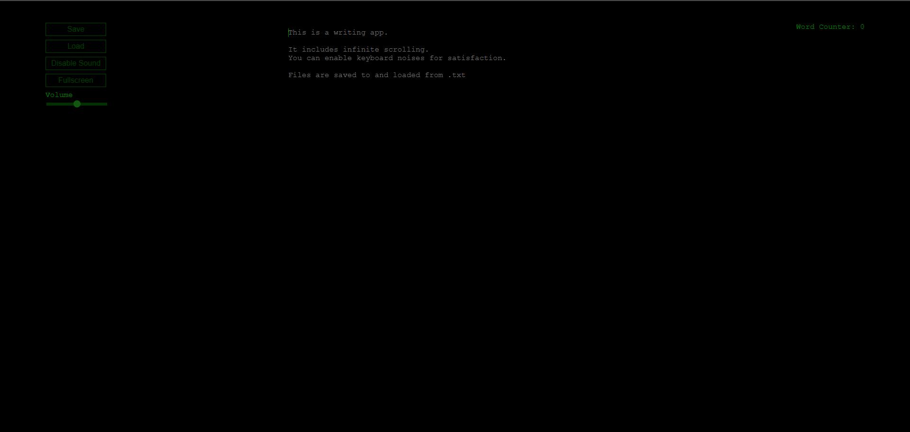

# CyberFrame (Minimal Writing App)

A simple and elegant writing application with sound effects and customizable volume control. Designed to provide a seamless and enjoyable writing experience.

## Features

- Infinite scrolling text area
- Customizable sound effects for keypresses
- Save and load text files
- Toggle fullscreen mode
- Volume control slider for sound effects
- Randomized filenames for saved files

## Screenshot



## Usage
www.cyberframe.org

## Local Installation

1. Clone the repository:
    ```sh
    git clone https://github.com/your-username/writing-app.git
    ```
2. Navigate to the project directory:
    ```sh
    cd writing-app
    ```
3. Start a local server (using Python):
    ```sh
    python -m http.server 8080
    ```
4. Open your browser and navigate to `http://localhost:8080`

## Usage

- **Save File**: Use the `Save` button or press `Ctrl+S` to save your work. The file will be saved with a randomized name.
- **Load File**: Use the `Load` button to load a text file into the text area.
- **Toggle Sound**: Use the `Enable Sound` button to toggle sound effects on and off.
- **Toggle Fullscreen**: Use the `Fullscreen` button to toggle fullscreen mode.
- **Volume Control**: Adjust the volume slider to change the sound effect volume.

## Contributing

Contributions are welcome! Please open an issue or submit a pull request.

## License

This project is licensed under the GNU GENERAL PUBLIC V3 License. See the [LICENSE](LICENSE) file for details.

